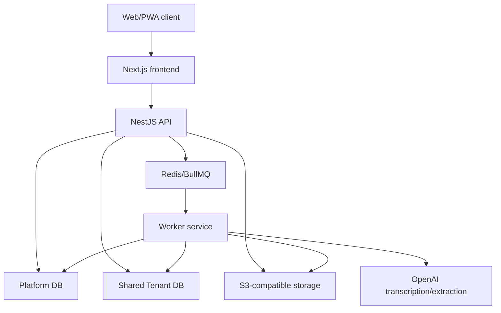
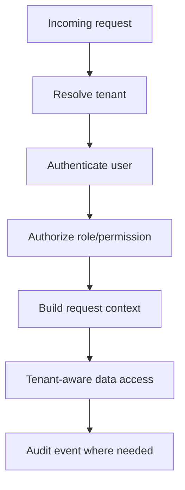
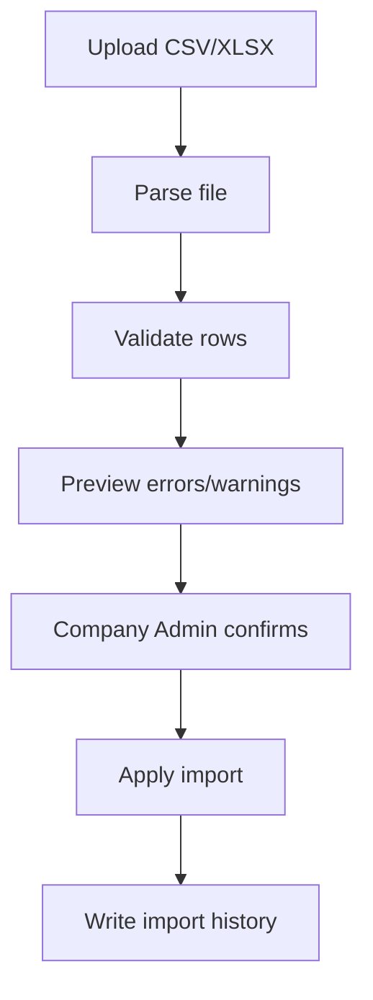
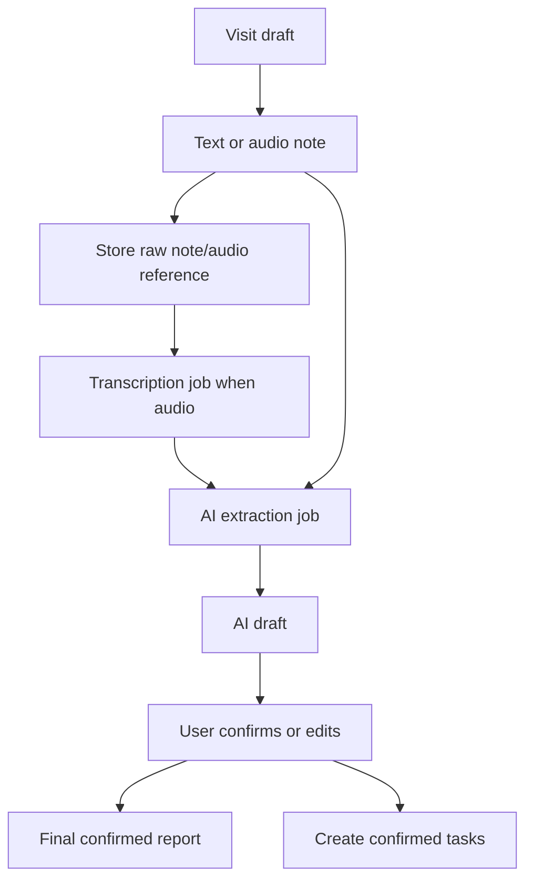

# Vizitum High-Level Technical Design: Team Pilot

## 1. Призначення документа

Цей документ описує high-level technical design для першого релізу `Vizitum Team Pilot`.

Мета HLD - зафіксувати архітектуру системи, межі модулів, tenancy model, deployment model, security principles, AI/job flows і технічні рішення, достатні для переходу до low-level design.

HLD спирається на:

- `docs/vizitum-mvp-product-spec-team-pilot.md`;
- `docs/vizitum-user-flows-horizontal-partition.md`;
- `docs/vizitum-technical-stack.md`.

HLD не деталізує повні database schemas, request/response DTO, Prisma models, exact permission policies, import mapping rules або prompt bodies. Це має бути покрито на low-level design етапі.

## 2. Scope

Перший реалізаційний scope:

- Product: `Vizitum Team Pilot`.
- Product mode: `team`.
- Commercial mode: `pilot`.
- Database placement: shared DB.
- Primary demo template: `distribution / trade reps`.
- Supported MVP templates: `distribution`, `service`, `partner_account`.
- Field app: mobile-first web/PWA з UX cache для стабільності інтерфейсу і draft preservation, без offline write queue.
- AI provider: OpenAI для transcription і structured extraction.

Out of scope для першого релізу:

- dedicated DB self-service;
- Executive Dashboard;
- granular access scope по регіонах, командах або територіях;
- native mobile app;
- full offline-first mode;
- billing automation;
- складні ERP/accounting/warehouse integrations;
- route optimization;
- BI-конструктор.

## 3. Confirmed Architecture Decisions

| Area | Decision |
| --- | --- |
| Frontend | Next.js, React, TypeScript, Tailwind CSS, shadcn/ui або Radix-based design system |
| Backend | Node.js, TypeScript, NestJS |
| ORM | Prisma |
| Database | PostgreSQL |
| Tenancy | shared DB для Pilot/Team, tenant isolation через `tenant_id` і tenant-aware data access |
| Auth | власний backend auth |
| Sessions | tenant-aware sessions/invite links |
| Jobs | Redis + BullMQ + окремий worker service |
| AI | OpenAI для transcription/extraction |
| Storage | S3-compatible storage з tenant-scoped paths |
| Deployment | recommended default: Vercel для frontend, managed app runtime для API/workers, managed PostgreSQL, managed Redis, S3/R2 |
| Offline | PWA cache тільки для UX smoothing і draft preservation; без full offline-first гарантій і без offline queue для збереження візитів |
| Legal/privacy | company-level згода/DPA або AI processing addendum підтверджується Company Admin |

## 4. Architecture Overview

Vizitum складається з одного shared web/app layer, backend API, worker service, platform database layer, shared tenant database layer, storage і external AI provider.



Основні принципи:

- app layer спільний для всіх tenants;
- tenant визначається на backend з host/slug/session/token;
- client не є source of truth для `tenant_id`;
- усі tenant-owned records у shared DB мають `tenant_id`;
- background jobs завжди несуть explicit tenant context;
- AI output не змінює final business data без підтвердження користувача;
- Platform DB не зберігає основні бізнес-дані клієнтів.

## 5. Deployment Model

Recommended default для першого production-ready MVP:

```text
Frontend: Vercel
API: Render / Fly.io / AWS ECS
Workers: Render / Fly.io / AWS ECS
Database: Managed PostgreSQL
Queue: Managed Redis
Storage: Cloudflare R2 / AWS S3 / Supabase Storage
CI/CD: GitHub Actions
Observability: app logs, metrics, error tracking, queue monitoring
```

Рішення про конкретного провайдера API/workers може бути прийняте після HLD. Архітектура не має залежати від одного runtime provider, окрім стандартних вимог:

- long-running jobs не виконуються у frontend/serverless request lifecycle;
- workers мають стабільний доступ до Redis, DB, storage і OpenAI;
- API і workers використовують спільні domain contracts;
- environment variables розділяються за environment: local, staging, production.

## 6. Application Boundaries

### Frontend

Frontend відповідає за:

- tenant-aware routing shell;
- role-based navigation;
- Platform Console UI для внутрішньої команди Vizitum;
- Company Admin onboarding/import/settings flows;
- Team Manager dashboard;
- Field Representative mobile-first daily flow;
- visit draft і AI draft confirmation UI;
- basic PWA caching.

Frontend не має:

- приймати `tenant_id` від користувача як джерело правди;
- виконувати permission decisions без backend verification;
- напряму звертатися до database/storage без backend-issued access pattern;
- зберігати raw sensitive data у browser logs.

### Backend API

Backend API відповідає за:

- tenant resolution;
- authentication;
- authorization;
- domain validation;
- tenant-aware data access;
- import preview/confirm flows;
- visit/report/task operations;
- job enqueueing;
- storage object registration;
- audit events;
- API error model.

### Worker Service

Worker service відповідає за:

- tenant provisioning jobs;
- import parsing/validation/apply jobs;
- transcription jobs;
- AI extraction jobs;
- export jobs, якщо вони зʼявляться після MVP;
- daily/weekly summary jobs;
- retry/failure handling;
- job status updates.

Workers не мають виконувати job без tenant context.

## 7. Tenancy and Data Isolation

MVP використовує shared tenant database для `Pilot` і `Team`.

Tenant context визначається через:

- host або tenant slug;
- authenticated session або invite token;
- tenant registry у Platform DB;
- backend tenant resolver.

Кожен request проходить:



Правила:

- tenant-owned tables мають `tenant_id`;
- queries до shared DB проходять через tenant-aware repository/service layer;
- API не приймає `tenant_id` з body як source of truth;
- background jobs містять `tenantId`, `actorId` або system actor, і job type;
- AI jobs можуть читати тільки дані поточного tenant;
- audit events пишуться з tenant context;
- integration tests мають перевіряти, що tenant A не бачить tenant B.

Dedicated DB має залишатися майбутнім extension для Business, але app layer має бути спроєктований так, щоб data source обирався через tenant registry.

## 8. Core Modules

### Platform

Відповідальність:

- tenant registry;
- tenant status;
- plan/product mode;
- database placement;
- provisioning status;
- operational health;
- assisted setup visibility;
- usage/pilot metrics.

### Auth

Відповідальність:

- email/password або invite-based account activation;
- magic invite links;
- session management;
- tenant-aware login;
- role loading;
- multi-role support;
- role switcher state.

### Users and Roles

Відповідальність:

- tenant users;
- user roles;
- effective permissions;
- invited/active/suspended user states;
- multi-role combinations.

MVP roles:

- Platform Owner;
- Company Admin;
- Team Manager;
- Field Representative.

Executive is not MVP implementation scope.

### Locations

Відповідальність:

- tenant locations;
- assigned representatives;
- location profile;
- contacts;
- territory/region fields as simple filters, not permission scopes;
- in MVP, territory/region must not be implemented or communicated as an access boundary;
- visit history;
- open tasks.

### Products

Відповідальність:

- products/SKU;
- optional product mode for pilots;
- not applicable state;
- product references in visit reports.

### Routes and Daily Plans

Відповідальність:

- daily plan;
- route items;
- manager assigned plans;
- representative self-planning within assigned locations;
- planned/visited/skipped status.

### Visits and Reports

Відповідальність:

- visit creation;
- visit draft;
- raw text/audio references;
- transcript;
- AI draft;
- final confirmed report;
- result status;
- follow-up tasks.

### Tasks

Відповідальність:

- task creation;
- assignment;
- due dates;
- task status;
- links to location/visit/report;
- overdue visibility.

### Imports

Відповідальність:

- CSV required format;
- XLSX direct support or assisted conversion;
- preview;
- validation;
- row-level errors/warnings;
- confirm/apply;
- import history;
- assisted setup provenance.

### AI Reporting

Відповідальність:

- transcription job;
- structured extraction job;
- versioned prompt/schema;
- draft output;
- user confirmation;
- audit trail;
- fallback manual report.

### Manager Dashboard

Відповідальність:

- team activity;
- plan/fact visits;
- representative activity;
- location coverage;
- open/overdue tasks;
- recent AI summaries;
- pilot review metrics.

## 9. Frontend Architecture

Frontend uses Next.js with role-oriented app areas:

```text
/platform
  Tenants
  Provisioning
  Operations

/{tenant}/admin
  Overview
  Imports
  Locations
  Users
  Products
  Templates
  Settings

/{tenant}/manager
  Team overview
  Visits
  Tasks
  Locations
  Representatives
  Reports

/{tenant}/field
  Today
  Routes
  Locations
  Visit
  Reports
  Settings
```

Frontend state:

- TanStack Query for server state;
- React Hook Form + Zod for forms;
- local PWA cache for stable field UX;
- no long-term source of truth in browser storage.

Mobile-first field UX priorities:

- fast today screen;
- low-friction location opening;
- simple visit start;
- text or voice note capture;
- visible AI processing state;
- manual fallback if AI fails.

## 10. Backend Architecture

Backend uses NestJS modules aligned with domains:

```text
src/modules/platform
src/modules/auth
src/modules/tenancy
src/modules/users
src/modules/roles
src/modules/locations
src/modules/products
src/modules/routes
src/modules/visits
src/modules/tasks
src/modules/imports
src/modules/ai
src/modules/storage
src/modules/audit
src/modules/operations
```

Cross-cutting backend components:

- tenant resolver;
- request context provider;
- auth guards;
- permission guards;
- tenant-aware Prisma access helpers;
- audit service;
- job enqueueing service;
- error mapper;
- structured logging.

API principles:

- all write operations validate tenant context;
- all tenant-owned reads filter by tenant context;
- user role and permission checks happen server-side;
- file upload creates a tenant-scoped storage reference;
- async operations return job/status IDs where needed;
- OpenAPI/Swagger should document public and internal endpoints separately.

## 11. Database Architecture

MVP logical database layers:

- Platform DB for tenant registry and operations metadata;
- Shared Tenant DB for tenant business data.

They may be separate PostgreSQL databases or separate schemas in early environments. Production design should preserve the conceptual separation.

Platform-level entity groups:

- tenants;
- tenant database placement;
- tenant status;
- product capabilities;
- provisioning jobs;
- platform audit/operations metadata.

Tenant-owned entity groups:

- users;
- roles and permissions;
- locations;
- contacts;
- products/SKU;
- routes;
- route items;
- visits;
- visit drafts;
- transcripts;
- AI outputs;
- final reports;
- tasks;
- imports;
- audit events.

Low-level design must define:

- Prisma schema;
- indexes;
- unique constraints;
- enum values;
- soft-delete strategy;
- audit table strategy;
- migration strategy;
- RLS decision for PostgreSQL, if used in addition to app-layer tenant filters.

## 12. Auth and Authorization

Auth approach:

- backend-owned auth module;
- invite links for onboarding users;
- session cookies or token strategy decided in low-level design;
- tenant context bound to session/request;
- roles loaded per tenant.

Authorization model:

- additive roles;
- effective permissions are union of assigned roles;
- product mode can enable/disable capability groups;
- Team Manager in Team mode has full tenant read view for operational data;
- Team Manager does not automatically get admin/settings/import/role rights;
- Field Representative sees assigned locations and own daily flow;
- Company Admin manages onboarding, users, imports, templates and tenant settings.

Low-level design must define:

- permission keys;
- role-permission matrix as code/config;
- permission guard API;
- multi-role switcher behavior;
- session invalidation and invite expiry.

## 13. Import Architecture

Import flow:



Supported MVP imports:

- locations;
- users;
- products/SKU.

Rules:

- Company Admin is the primary product operator for imports;
- Vizitum team may assist by preparing file, converting XLSX, or creating draft/import job;
- Company Admin confirms application of client data;
- duplicate user email in same tenant is blocking;
- duplicate location name/address is warning with merge/skip decision;
- failed import must not partially corrupt production data;
- import history stores actor, source, file metadata, row counts, errors and confirmation actor.

## 14. AI and Voice Reporting

AI flow:



Key rules:

- AI provider for MVP: OpenAI;
- raw audio stored in tenant-scoped storage;
- raw notes, transcripts, AI outputs and final reports are stored for audit/debug;
- raw notes, transcripts and AI outputs are not written to logs;
- AI draft never changes final business data without user confirmation;
- tasks from AI draft are created only after confirmation;
- manual text fallback is always available;
- failed AI job must not block manual final report.

Low-level design must define:

- AI output schema per template;
- prompt/schema versioning;
- job retry policy;
- transcription status model;
- AI output states: draft, confirmed, edited, discarded;
- retention policy for raw audio and transcripts.

## 15. Storage Architecture

Storage is used for:

- raw visit audio;
- import files;
- exports, if added later;
- optional photos, post-MVP.

Tenant-scoped path pattern:

```text
tenants/{tenantId}/visit-audio/{visitId}/{fileId}.webm
tenants/{tenantId}/imports/{importId}/{fileName}
tenants/{tenantId}/exports/{exportId}/{fileName}
```

Storage access principles:

- API controls upload registration;
- storage object metadata is stored in database with tenant context;
- direct public access is not allowed for sensitive files;
- signed URLs must be short-lived;
- logs must not include sensitive content.

## 16. Observability and Audit

MVP observability must cover:

- API error rate;
- tenant resolution failures;
- auth failures;
- import failures;
- job queue status;
- transcription failures;
- AI extraction failures;
- storage failures;
- database health;
- tenant-level usage metrics for pilot review.

Audit events should cover:

- tenant created/status changed;
- invite sent/accepted;
- role changed;
- import uploaded/previewed/confirmed/applied;
- visit created;
- AI draft generated;
- final report confirmed;
- task created/updated;
- settings changed.

Audit logs must include tenant context and actor context, but not raw sensitive content.

## 17. Security and Privacy

Security principles:

- tenant isolation is a release-blocking requirement;
- backend is source of truth for tenant context and permissions;
- sensitive business data is not logged;
- raw audio/transcripts/AI outputs are tenant-scoped;
- storage uses private buckets and signed access;
- API validates all inputs;
- password/session/token storage follows standard secure practices;
- CI includes isolation tests.

Privacy/legal for MVP:

- Company Admin confirms company-level DPA or AI processing addendum for pilot before production pilot;
- user sees short in-app notice before first voice recording;
- AI processing is transparent in the visit flow;
- failed AI processing has manual fallback;
- retention policy must be finalized before production pilot.

## 18. Reliability and Performance

MVP reliability requirements:

- failed import does not corrupt applied data;
- failed transcription/AI does not block manual reporting;
- workers use retry strategy and dead-letter/failure visibility;
- job status is visible to operations;
- API handles tenant not found, suspended tenant, invalid role and missing permission clearly.

Initial performance target:

- comfortable operation for a pilot tenant with 5-10 field representatives;
- Team mode target up to 30 representatives;
- dashboards should use indexed queries and avoid unbounded scans;
- AI and import operations run asynchronously.

## 19. MVP Delivery Phases

### Phase 0: Foundation

- Repo/app skeleton.
- NestJS API.
- Next.js frontend.
- PostgreSQL + Prisma.
- Redis/BullMQ.
- Tenant registry.
- Shared tenant DB schema.
- Tenant resolver.
- Basic auth/invite flow.
- Basic audit.

### Phase 1: Core Field Flow

- Locations.
- Assigned locations.
- Daily plan/routes.
- Visit creation.
- Text note.
- Manual final report.
- Tasks.

### Phase 2: Imports and Onboarding

- Company Admin onboarding checklist.
- Locations import.
- Users import.
- Products/SKU import or not applicable state.
- Preview/validation/confirm flow.
- Assisted setup provenance.

### Phase 3: AI Visit Reporting

- Audio upload/recording flow.
- Transcription job.
- AI extraction job.
- AI draft confirmation UI.
- Final confirmed report.
- AI audit.

### Phase 4: Manager and Pilot Review

- Team dashboard.
- Visit list.
- Task list.
- Location coverage.
- Representative activity.
- Pilot review metrics.
- Copyable pilot summary.
- Basic operations monitoring.

## 20. Open Questions for Low-Level Design

These questions do not block HLD, but must be resolved before implementation:

- Exact Prisma schema and migration strategy.
- Whether to use PostgreSQL RLS in addition to app-layer tenant filters.
- Session implementation: cookie sessions, JWT, or hybrid.
- Full permission key list and role-permission matrix as code.
- API DTOs, pagination, filtering and error format.
- Exact import templates and validation rules.
- XLSX direct parser versus assisted conversion only for launch.
- Browser audio format strategy: MediaRecorder detection, preferred `audio/webm;codecs=opus`, iOS/Safari fallback such as `audio/mp4` or `audio/mp4;codecs=mp4a.40.2`, accepted upload formats and backend normalization rules.
- AI extraction schemas for `distribution`, `service`, `partner_account`.
- Prompt versioning and retention policy for raw audio/transcripts.
- Storage provider choice: S3, R2 or Supabase Storage.
- API/workers runtime provider: Render, Fly.io or AWS ECS.
- Observability vendor/tooling.
- Backup/restore strategy for shared DB.

## 21. HLD Definition of Done

This HLD is sufficient when:

- MVP scope and out-of-scope capabilities are explicit;
- architecture boundaries are clear;
- tenancy and isolation principles are defined;
- core modules are named;
- async jobs and AI flow are separated from request lifecycle;
- security/privacy principles are captured;
- company-level DPA or AI processing addendum and first-recording in-app notice are treated as release-blocking for production pilot;
- raw audio/transcript retention policy is finalized before production pilot;
- delivery phases are defined;
- low-level design questions are clearly listed.
