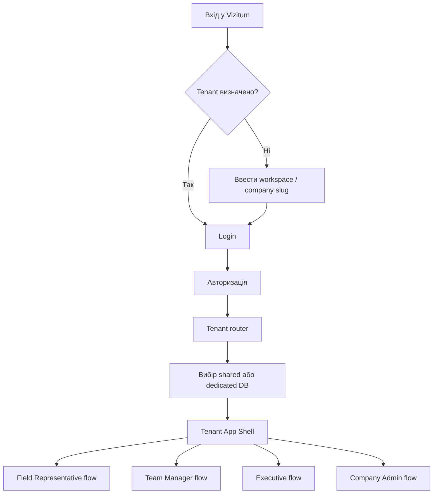
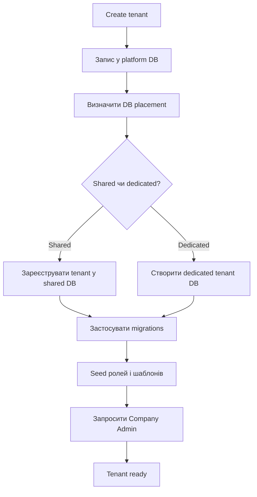
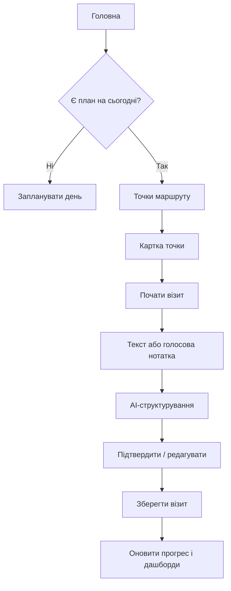
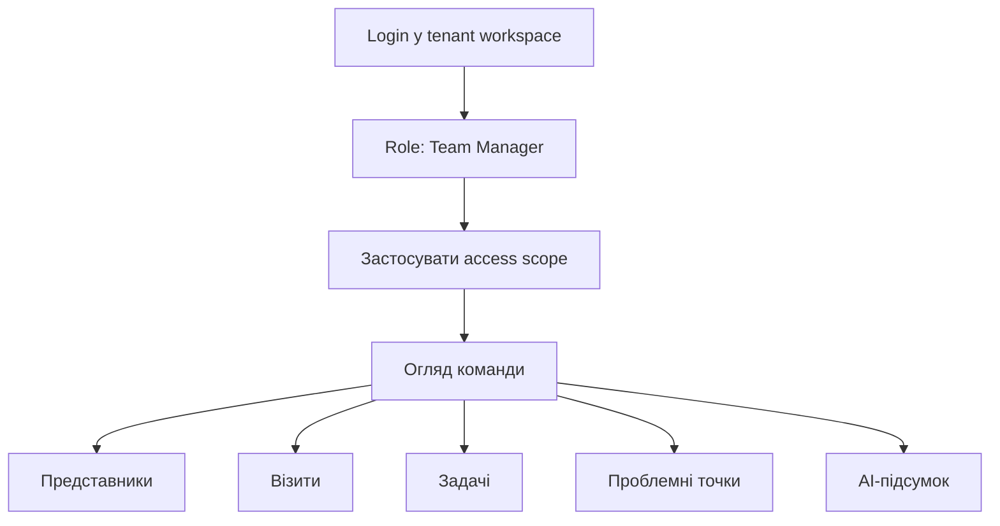
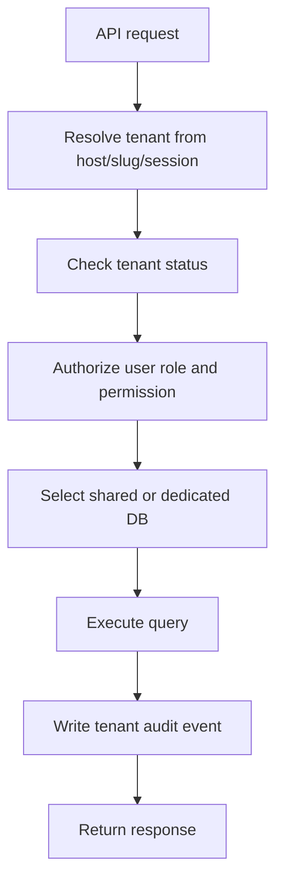
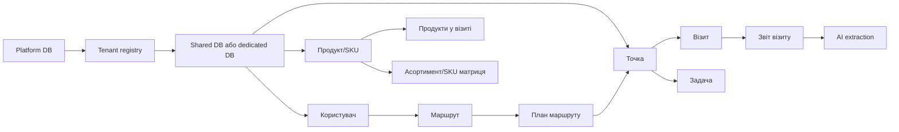

# Vizitum: user flow для гібридної tenancy-платформи

## 1. Призначення платформи

Vizitum - це веб-платформа для польових команд, які планують маршрути, проводять візити до точок, фіксують результати, працюють з продуктами, задачами та управлінською аналітикою.

Архітектурна модель платформи: **гібридна tenancy-модель** з можливістю horizontal partition для більших клієнтів.

Це означає:

- web/app layer спільний для всіх клієнтів;
- для пілотів і малих компаній використовується shared tenant database з логічною ізоляцією по tenant;
- для Business/Enterprise клієнтів dedicated tenant database доступна як опція;
- кожен запит виконується в контексті конкретного tenant;
- користувачі, точки, продукти, візити, задачі та звіти завжди належать конкретному tenant;
- центральна platform database зберігає tenant registry, billing/status, database placement, routing rules, глобальні налаштування та операційні метадані.

Головна ціль user flow: зробити так, щоб пілоти і малі компанії запускались швидко в shared DB, але більші клієнти могли перейти на dedicated DB без зміни web/app layer.

### Модель розміщення даних

| Сегмент | Базова модель | Опція | Логіка |
| --- | --- | --- | --- |
| Pilot | shared DB | ні або тільки вручну | швидкий запуск, мінімальна операційна вартість |
| Team/small business | shared DB | можливо як paid add-on | оптимально для малих команд і повторюваних пілотів |
| Business | shared DB або dedicated DB | так | клієнт може обрати ізоляцію даних як частину пакета |
| Enterprise | dedicated DB | custom deployment | вимоги безпеки, SLA, інтеграції, аудит |

Важливе правило: tenant isolation обовʼязкова в обох моделях. У shared DB вона забезпечується через `tenant_id`, RLS/policy layer, tenant-aware queries та тести ізоляції. У dedicated DB вона посилюється фізичним розділенням бази, але app layer залишається спільним.

## 2. Рівні користувачів

### Platform Owner

Внутрішня роль команди Vizitum. Керує клієнтами, пілотами, provisioning, станом tenant database або shared tenant pool, тарифами, імпортами та операційним моніторингом.

Доступні розділи:

- `Tenants` - список клієнтських середовищ.
- `Provisioning` - створення і налаштування tenant placement.
- `Imports` - статуси імпорту клієнтських даних.
- `Templates` - базові шаблони процесів, ролей, полів, AI-структурування.
- `Operations` - health, errors, usage, background jobs.
- `Billing` - тариф, статус оплати, ліміти.

### Company Admin

Адміністратор конкретної компанії-клієнта. Працює тільки всередині свого tenant workspace.

Доступні розділи:

- `Огляд` - управлінська панель.
- `Точки` - аптеки, клініки, магазини, партнери або інші точки.
- `Користувачі` - представники, керівники, адміністратори.
- `Продукти` - продукти, SKU, товарні групи.
- `Маршрути` - маршрути та планування.
- `Звіти` - візити, задачі, покриття, активність.
- `Налаштування` - профіль компанії, поля, шаблони, імпорт, branding.

### Team Manager

Керівник польової команди, регіону або напрямку. Це окрема бізнес-роль, не те саме, що `Company Admin`. Керівник заходить у той самий tenant workspace, але після логіну потрапляє в управлінський dashboard, а не в налаштування системи.

Керівник бачить команду, активність, задачі, маршрути, проблемні точки та аналітику в межах свого access scope. Scope може бути:

- вся компанія;
- один або кілька регіонів;
- одна або кілька команд;
- конкретні представники;
- конкретні території або групи точок.

Керівник не обовʼязково має доступ до імпортів, billing, tenant settings, налаштування полів або керування платформою.

Доступні розділи:

- `Огляд команди`.
- `Карта / покриття`.
- `Візити`.
- `Задачі`.
- `Точки`.
- `Представники`.
- `Звіти`.

### Company Owner / Executive

Власник, CEO, комерційний директор або топкерівник компанії. Це роль для high-level перегляду бізнес-показників без щоденного операційного адміністрування системи.

Executive бачить аналітику по всій компанії або по дозволених бізнес-напрямках:

- загальну активність польової команди;
- план/факт по компанії, регіонах і командах;
- покриття точок;
- динаміку візитів;
- проблемні точки і продукти;
- відкриті та прострочені задачі;
- AI-підсумки по компанії, регіонах або продуктах;
- експорт управлінських звітів.

Executive не налаштовує довідники, імпорти, поля, provisioning або database placement без додаткових прав.

Доступні розділи:

- `Executive Dashboard`.
- `Команди`.
- `Регіони`.
- `Покриття`.
- `Звіти`.
- `AI-підсумки`.

### Field Representative

Польовий користувач. Основний mobile-first flow: план на день, маршрут, картка точки, візит, звіт, задачі.

Доступні розділи:

- `Головна` - план на сьогодні.
- `Маршрути` - власні маршрути і планування.
- `Точки` - закріплені точки.
- `Зведення` - історія візитів.
- `Налаштування`.

## 3. Загальна модель навігації

Платформа має два рівні навігації:

- platform navigation для команди Vizitum;
- tenant navigation для користувачів конкретної компанії.

Клієнт може заходити через:

- спільний домен з tenant slug: `app.vizitum.com/{tenant}`;
- або branded subdomain: `{tenant}.vizitum.com`;
- у майбутньому для enterprise: custom domain.

## 4. Tenant provisioning flow

### Ціль

Команда Vizitum створює нове клієнтське середовище для пілоту або платного клієнта без ручного копіювання коду і без окремого web deployment. За замовчуванням tenant розміщується у shared DB; dedicated DB обирається як опція для Business/Enterprise або спеціальних вимог.

### Кроки

1. Platform Owner відкриває `Tenants`.
2. Натискає `Create tenant`.
3. Заповнює:
   - назву компанії;
   - tenant slug;
   - тип сегмента: pharma, OTC, FMCG, distributor, service або custom;
   - тариф: pilot, team, business, enterprise;
   - країну, timezone, мову;
   - контактну особу;
   - очікувану кількість користувачів і точок;
   - database placement: shared або dedicated.
4. Система створює запис у platform database.
5. Provisioning job визначає database placement. Для `pilot` і `team` за замовчуванням використовується shared tenant database. Для `business` або `enterprise` можна створити dedicated tenant database.
6. Система перевіряє або застосовує базові migrations до відповідної database.
7. Система встановлює стартові довідники і шаблони:
   - ролі;
   - типи точок;
   - типи візитів;
   - статуси задач;
   - шаблон AI-структурування;
   - стандартні поля.
8. Система створює першого Company Admin.
9. Company Admin отримує invite email.
10. Tenant переходить у статус `ready`.

### Чи потрібна сегментація за типом бізнесу

Сегментація потрібна, але не як окремі продукти або окремі codebase для `pharma`, `OTC`, `FMCG`, `distributor`, `service` чи `custom`. Оптимальна модель для Vizitum: **універсальна платформа з вертикальними preset-шаблонами**.

`segment_type` має визначати стартову конфігурацію tenant:

- типи точок;
- типи візитів;
- стандартні поля в картці точки;
- шаблони звіту після візиту;
- словники продуктів/SKU;
- типові задачі;
- dashboard-и і KPI;
- AI-шаблони структурування нотаток.

Core-сутності залишаються універсальними: користувачі, ролі, точки, продукти, маршрути, візити, задачі, звіти, території, імпорти та tenant isolation.

#### Аргументи за сегментацію

- **Швидший onboarding.** Pharma-клієнт одразу отримує поля для лікарів, аптек, спеціалізацій, візитів і промоційних активностей. FMCG-клієнт - поля для магазинів, мереж, полиць, SKU, наявності товару і мерчандайзингу.
- **Краща мова продукту.** Для pharma природно говорити `лікар`, `аптека`, `препарат`, `візит`. Для FMCG - `торгова точка`, `SKU`, `викладка`, `залишки`, `акція`. Це зменшує відчуття, що клієнт користується чужою CRM.
- **Релевантна аналітика.** OTC може дивитися покриття аптек і активність по категоріях, distributor - виконання доставки/замовлень по маршрутах, service - SLA, повторні звернення і виконання робіт.
- **Простіший продаж.** Демо для pharma і демо для FMCG можуть показувати той самий core, але різні словники, приклади даних і dashboard-и.
- **Менше ручної кастомізації.** Замість налаштовувати кожен tenant з нуля, Platform Owner обирає segment type і отримує готовий baseline.

#### Аргументи проти жорсткої сегментації

- **Ризик роздроблення продукту.** Якщо зробити окрему логіку для кожного сегмента, кожна нова функція потребуватиме реалізації і тестування в кількох варіантах.
- **Складні міграції та підтримка.** Окремі схеми даних для pharma/FMCG/service швидко ускладнять migrations, імпорти, permissions і звіти.
- **Клієнти часто змішані.** OTC-компанія може працювати і з аптеками, і з FMCG-like retail. Distributor може мати торгових представників, складські задачі і сервісні візити одночасно.
- **Custom може стати пасткою.** Якщо кожен custom tenant отримує унікальну логіку, платформа перетвориться на набір індивідуальних проєктів.
- **Важче масштабувати AI і аналітику.** Єдина модель візитів, точок і задач дає спільну основу для AI-підсумків, benchmark-ів і cross-tenant improvements.

#### Приклади сегментних preset-ів

| Segment type | Приклади точок | Приклади полів | Приклади KPI |
| --- | --- | --- | --- |
| `pharma` | лікар, аптека, клініка | спеціалізація, потенціал, продукти інтересу, останній контакт | покриття лікарів, частота візитів, активність по препаратах |
| `OTC` | аптека, аптечна мережа, дистрибʼюторська точка | категорія аптеки, наявність SKU, промоактивність, конкурентні продукти | покриття аптек, представленість SKU, виконання промо |
| `FMCG` | магазин, мережа, кіоск, HoReCa | полиця, фейсинг, ціна, залишок, POSM | availability, share of shelf, promo compliance |
| `distributor` | клієнт, склад, магазин, партнер | маршрут доставки, замовлення, борг, статус поставки | виконання маршруту, замовлення, overdue задачі |
| `service` | обʼєкт, клієнт, обладнання, локація | тип робіт, SLA, серійний номер, статус проблеми | виконання SLA, час закриття задач, повторні звернення |
| `custom` | визначається клієнтом | визначається шаблоном | визначається шаблоном |

#### Рекомендація

Vizitum варто будувати як **універсальну платформу з configurable vertical templates**:

- не створювати окремі app/database моделі для кожного сегмента;
- зберігати `segment_type` у tenant registry;
- використовувати segment type для seed templates, назв сутностей, dashboard preset-ів і AI prompts;
- дозволити Company Admin змінювати поля, словники і шаблони після onboarding;
- для `custom` не писати унікальну бізнес-логіку без окремого product decision, а спершу описувати її через конфігурацію.

Так платформа залишається універсальною технічно, але виглядає спеціалізованою для конкретного клієнта.

### Статуси tenant

- `draft` - створено запис, але provisioning ще не почався.
- `provisioning` - визначається database placement, tenant реєструється у shared DB або створюється dedicated DB, застосовуються migrations.
- `ready` - клієнтське середовище готове.
- `pilot_active` - триває пілот.
- `active` - платний клієнт.
- `suspended` - доступ обмежено.
- `archived` - клієнт відключений, дані збережені згідно політики.

## 5. Onboarding клієнта

### Ціль

Company Admin готує робоче середовище для своєї команди: користувачі, точки, продукти, маршрути, поля і базові правила.

### Кроки

1. Company Admin переходить за invite link.
2. Встановлює пароль або входить через доступний auth provider.
3. Потрапляє в onboarding checklist.
4. Завантажує базу точок через CSV/XLSX.
5. Завантажує список продуктів або SKU.
6. Додає користувачів вручну або імпортом.
7. Призначає ролі і території.
8. Налаштовує типи точок, поля і шаблон візиту.
9. Перевіряє тестовий маршрут.
10. Запрошує представників.
11. Tenant переходить у статус `pilot_active`.

### Onboarding checklist

- компанія створена;
- перший адміністратор активний;
- точки імпортовані;
- продукти імпортовані;
- користувачі створені;
- ролі призначені;
- території налаштовані;
- шаблон візиту обраний;
- AI-структурування протестоване;
- перший маршрут створений.

## 6. Tenant-aware авторизація

### Вхід користувача

1. Користувач відкриває tenant URL.
2. App layer визначає tenant за subdomain або slug.
3. Система перевіряє tenant registry у platform database.
4. Якщо tenant активний, користувач бачить login screen з branding компанії.
5. Після логіну auth layer отримує:
   - user id;
   - tenant id;
   - role;
   - permissions;
   - database placement і routing key.
6. Усі подальші API-запити виконуються тільки в контексті tenant. App layer обирає shared або dedicated database за tenant registry.
7. Після входу система відкриває стартовий екран відповідно до ролі:
   - `Field Representative` -> `Головна`;
   - `Team Manager` -> `Огляд команди`;
   - `Company Admin` -> `Admin / Огляд`;
   - `Executive` -> `Executive Dashboard`, якщо така роль увімкнена;
   - `Platform Owner` -> `Platform Console`.

### Якщо tenant не знайдено

Користувач бачить сторінку:

- workspace not found;
- звернутися до адміністратора;
- перейти до вибору іншого workspace.

### Якщо tenant suspended

Користувач бачить сторінку:

- доступ тимчасово обмежений;
- контакт адміністратора компанії;
- контакт підтримки Vizitum.

## 7. Основний денний flow представника

### Ціль

Представник бачить свій план на сьогодні, проходить точки, фіксує візити, створює задачі і оновлює інформацію по точках.

### Кроки

1. Представник входить у tenant workspace.
2. Система відкриває `Головна`.
3. Додаток показує:
   - дату;
   - прогрес дня;
   - заплановані маршрути;
   - точки маршруту;
   - відкриті задачі;
   - швидку дію `Почати візит`.
4. Якщо маршруту немає, представник бачить empty state і кнопку `Запланувати день`.
5. Представник відкриває точку.
6. У картці точки переглядає:
   - адресу і контакти;
   - сегмент;
   - потенціал;
   - продукти/SKU;
   - задачі;
   - історію візитів;
   - попередні AI-підсумки.
7. Натискає `Почати візит`.
8. Заповнює або диктує результат.
9. AI структурує нотатку.
10. Представник підтверджує або редагує AI-пропозиції.
11. Зберігає звіт.
12. Дані потрапляють у database, привʼязану до tenant і стають доступні керівнику.

## 8. Flow картки точки

Картка точки є універсальною. У pharma це може бути аптека або клініка, у FMCG - магазин, у дистрибуції - торговий партнер, у сервісній команді - об'єкт обслуговування.

### Базові блоки

- назва;
- тип точки;
- адреса;
- контакти;
- відповідальний представник;
- територія;
- статус;
- сегмент;
- потенціал;
- останній візит;
- наступна дія.

### Конфігуровані блоки

Company Admin може вмикати або вимикати:

- асортимент;
- потенціал по групах;
- SKU-матрицю;
- фото;
- чеклист візиту;
- промо-матеріали;
- залишки;
- замовлення;
- мерчандайзинг;
- custom fields.

### Дії

Користувач може:

- почати візит;
- створити задачу;
- оновити контактні дані;
- переглянути історію;
- додати нотатку;
- оновити асортимент або SKU;
- переглянути AI-підсумки по точці.

## 9. Flow створення візиту

### Вхідні точки

Створити візит можна:

- з картки точки;
- з денного маршруту;
- з календаря;
- через quick action;
- з задачі.

### Поля форми

Базові поля:

- точка;
- дата і час;
- тип візиту;
- результат;
- нотатки;
- наступна дія;
- задачі;
- презентовані продукти;
- статуси SKU або асортименту.

Додаткові поля залежать від tenant configuration.

### Голосовий і AI flow

1. Представник натискає кнопку мікрофона.
2. Диктує результат візиту.
3. Система зберігає raw audio у tenant-scoped storage.
4. Transcription service створює raw transcript.
5. AI extraction service застосовує tenant-specific шаблон.
6. Система показує structured draft:
   - короткий підсумок;
   - домовленості;
   - заперечення;
   - проблемні продукти;
   - наступні дії;
   - задачі;
   - оновлення по SKU.
7. Представник підтверджує або редагує.
8. API зберігає raw note, transcript, AI output і фінальний звіт у database, привʼязану до tenant.

### Важливе правило

AI output не має автоматично змінювати бізнес-дані без підтвердження користувача, окрім явно дозволених low-risk полів.

## 10. Flow маршрутів і планування

### Представник

Представник може:

- переглядати власні маршрути;
- створювати маршрут, якщо це дозволено роллю;
- планувати день;
- додавати позапланову точку;
- бачити план/факт.

### Керівник

Керівник може:

- створювати маршрути для команди;
- призначати маршрути представникам;
- переглядати покриття території;
- бачити пропущені точки;
- порівнювати план/факт;
- аналізувати частоту візитів.

### Company Admin

Company Admin налаштовує:

- території;
- правила видимості точок;
- права на самостійне планування;
- циклічність маршрутів;
- шаблони робочих тижнів.

## 11. Flow керівника команди

### Ціль

Керівник заходить у Vizitum, щоб щодня бачити реальну роботу польової команди, контролювати план/факт, знаходити проблемні точки, переглядати візити і ставити задачі представникам.

Керівник не є системним адміністратором за замовчуванням. Його основний сценарій - управління командою та аналітика, а не налаштування tenant.

### Створення керівника

1. Company Admin відкриває `Користувачі`.
2. Створює або редагує користувача.
3. Призначає роль `Team Manager`.
4. Визначає access scope:
   - вся компанія;
   - регіон;
   - команда;
   - список представників;
   - територія або група точок.
5. Система надсилає invite email.
6. Керівник активує акаунт і входить у tenant workspace.

### Вхід керівника

1. Керівник відкриває tenant URL, наприклад `{tenant}.vizitum.com`.
2. Вводить email і пароль.
3. Auth layer визначає tenant, роль і access scope.
4. Після логіну система відкриває `Огляд команди`.
5. Усі дані в dashboard фільтруються за scope керівника.

### Огляд команди

Керівник бачить:

- активність сьогодні;
- хто вже почав день;
- хто не має запланованого маршруту;
- план/факт візитів;
- візити за день, тиждень або період;
- відкриті задачі;
- прострочені задачі;
- точки без візитів;
- високий потенціал без покриття;
- проблемні продукти або SKU;
- активність по представниках;
- AI-підсумок по команді.

### Щоденний flow керівника

1. Керівник відкриває `Огляд команди`.
2. Перевіряє, хто з представників має план на сьогодні.
3. Дивиться план/факт візитів.
4. Відкриває список проблемних або пропущених точок.
5. Переглядає нові звіти візитів.
6. Перевіряє AI-підсумок дня.
7. Створює задачі представникам або залишає коментарі.
8. За потреби переходить у картку представника, точки або конкретного візиту.

### Drill-down

Керівник може перейти:

- з компанії або регіону до команди;
- з команди до представника;
- з представника до маршруту;
- з маршруту до точки;
- з точки до історії візитів;
- з візиту до raw note, transcript і AI extraction;
- з AI-підсумку до конкретного raw report;
- з проблемного SKU до точок, де він згадувався.

### Дії керівника

Керівник може:

- створити задачу для представника;
- прокоментувати візит;
- позначити візит як переглянутий;
- призначити follow-up по точці;
- змінити пріоритет точки, якщо це дозволено правами;
- експортувати звіт за період;
- переглянути AI summary по дню, тижню, регіону або представнику.

Керівник не може без додаткових прав:

- змінювати tenant settings;
- керувати billing;
- запускати provisioning;
- змінювати database placement;
- редагувати глобальні шаблони;
- імпортувати великі довідники, якщо це не дозволено Company Admin.

### Weekly review

1. Керівник відкриває період тижня.
2. Система показує ключові зміни по команді.
3. AI формує короткий management summary.
4. Керівник переглядає:
   - найактивніших представників;
   - точки без покриття;
   - прострочені задачі;
   - проблемні продукти;
   - повторювані заперечення з візитів.
5. Керівник створює задачі або follow-up для представників.
6. За потреби експортує короткий звіт для комерційного директора.

### Access scope rules

- Керівник бачить тільки ті дані, які входять у його scope.
- Якщо представник переходить в інший регіон, видимість для керівника оновлюється через territory/team assignment.
- API не приймає `manager_id` або `team_id` з client-side як джерело правди. Scope визначається на backend за роллю і tenant permissions.
- AI summaries для керівника формуються тільки з даних, доступних цьому керівнику.

## 12. Company Admin flow

### Управління користувачами

Company Admin може:

- створювати користувачів;
- імпортувати користувачів;
- запрошувати користувачів;
- активувати і деактивувати акаунти;
- призначати ролі;
- призначати керівників і access scope;
- призначати території;
- скидати доступ;
- переглядати останню активність.

### Управління точками

Company Admin може:

- створювати точки;
- імпортувати точки;
- редагувати точки;
- об'єднувати дублікати;
- призначати відповідальних;
- сегментувати точки;
- керувати мережами, регіонами, категоріями.

### Управління продуктами

Company Admin може:

- створювати продукти/SKU;
- імпортувати продукти;
- групувати продукти;
- деактивувати продукти;
- налаштовувати видимість продуктів для команд.

### Налаштування процесу

Company Admin може налаштувати:

- типи візитів;
- обов'язкові поля;
- custom fields;
- шаблони задач;
- шаблони AI extraction;
- branding;
- мову;
- експортні формати.

## 13. Platform operations flow

### Моніторинг tenant health

Platform Owner бачить:

- статус tenant database або shared DB pool;
- останню міграцію;
- кількість активних користувачів;
- кількість API помилок;
- чергу background jobs;
- помилки AI/transcription;
- storage usage;
- database size і tenant storage usage.

### Міграції

1. Команда Vizitum готує нову schema migration.
2. Migration runner перевіряє shared DB pools і dedicated tenant databases.
3. Міграція застосовується поступово.
4. Для кожного tenant зберігається статус:
   - pending;
   - running;
   - success;
   - failed;
   - rolled back/manual action required.
5. App layer має знати мінімальну підтримувану schema version.

### Backup і restore

Restore flow має підтримувати два сценарії: tenant-level restore для shared DB і full database restore для dedicated DB:

1. Platform Owner відкриває tenant.
2. Обирає backup point.
3. Запускає restore у staging або recovery database.
4. Перевіряє цілісність.
5. Перемикає tenant routing або експортує потрібні дані.

## 14. Data isolation flow

Кожен API-запит має проходити tenant resolution.

Правила:

- API не приймає tenant id з body як джерело правди;
- tenant визначається з host/slug/session/token;
- platform database не зберігає бізнес-дані клієнта, окрім мінімальних операційних метаданих;
- dedicated tenant database не має знати про інші tenant; shared database обовʼязково фільтрується по tenant_id;
- background jobs завжди мають явний tenant context;
- logs не повинні містити чутливі raw notes або transcripts.

## 15. Основні доменні зв'язки

## 16. Ключові API-зони

### Platform API

| Дія | Endpoint |
| --- | --- |
| Список tenants | `/api/platform/tenants` |
| Створення tenant | `/api/platform/tenants` |
| Статус provisioning | `/api/platform/tenants/{tenantId}/provisioning` |
| Запуск імпорту | `/api/platform/tenants/{tenantId}/imports` |
| Health tenant | `/api/platform/tenants/{tenantId}/health` |
| Міграції | `/api/platform/migrations` |

### Tenant API

| Дія | Endpoint |
| --- | --- |
| Поточний workspace | `/api/me/workspace` |
| Денний план | `/api/route-plans/{date}` |
| Візити | `/api/visits`, `/api/visits/{id}` |
| AI-обробка звіту | `/api/visits/{id}/ai-extract` або `/api/visit-drafts/ai-extract` |
| Транскрипція | `/api/visit-drafts/transcribe` |
| Точки | `/api/locations`, `/api/locations/{id}` |
| Продукти | `/api/products`, `/api/product-groups` |
| Задачі | `/api/tasks`, `/api/tasks/{id}` |
| Маршрути | `/api/routes`, `/api/route-plans` |
| Дашборд керівника | `/api/manager/dashboard` |
| Адмін-огляд | `/api/admin/dashboard` |
| Налаштування tenant | `/api/admin/settings` |

## 17. QA-сценарії

### Platform: створення нового пілоту

1. Увійти як Platform Owner.
2. Створити tenant з типом `pilot`.
3. Переконатися, що створено tenant registry record.
4. Переконатися, що tenant отримав database placement: shared або dedicated.
5. Переконатися, що migrations виконані.
6. Переконатися, що seed data створена.
7. Надіслати invite Company Admin.
8. Увійти через tenant subdomain.
9. Переконатися, що користувач бачить тільки дані свого tenant.

### Company Admin: підготовка пілоту

1. Увійти як Company Admin.
2. Імпортувати точки.
3. Імпортувати продукти.
4. Створити представників.
5. Призначити території.
6. Створити маршрут.
7. Запросити представника.
8. Переконатися, що представник бачить лише свої точки.

### Представник: повний день

1. Увійти через tenant workspace.
2. Відкрити `Головна`.
3. Перейти до точки з маршруту.
4. Почати візит.
5. Продиктувати нотатку.
6. Перевірити transcript.
7. Підтвердити AI-структурування.
8. Зберегти звіт.
9. Переконатися, що прогрес дня оновився.
10. Переконатися, що керівник бачить візит у дашборді.

### Керівник: dashboard і scope

1. Увійти як Company Admin.
2. Створити двох представників у різних регіонах або командах.
3. Створити користувача з роллю `Team Manager`.
4. Призначити керівнику scope тільки на один регіон або одну команду.
5. Увійти як керівник.
6. Переконатися, що після логіну відкривається `Огляд команди`.
7. Переконатися, що dashboard показує тільки представників, точки, візити і задачі в межах scope.
8. Створити задачу для доступного представника.
9. Спробувати відкрити дані представника поза scope.
10. Переконатися, що доступ заборонено.
11. Переконатися, що AI summary не містить даних поза scope керівника.

### Data isolation

1. Створити два tenants.
2. У кожному tenant створити користувача, точки і продукти.
3. Увійти в tenant A.
4. Спробувати відкрити URL або API resource tenant B.
5. Переконатися, що доступ заборонено.
6. Перевірити, що background jobs tenant A не читають дані tenant B.

### Migration safety

1. Запустити migration на staging tenant.
2. Перевірити schema version.
3. Запустити batch migration на кількох tenants.
4. Симулювати помилку на одному tenant.
5. Переконатися, що інші tenants не заблоковані.
6. Переконатися, що failed tenant має статус manual action required.

## 18. Відомі обмеження і рішення на старті

- Для пілотів і малих компаній базова модель - shared tenant database з логічною ізоляцією по tenant_id.
- Dedicated database і окремий app deployment не варто робити правилом для базового пакета.
- Dedicated deployment варто залишити для enterprise-рівня.
- Tenant-specific custom logic має реалізовуватись через конфігурації, а не через fork коду.
- Міграції shared DB і dedicated DB треба автоматизувати з першого етапу.
- AI prompts і extraction schemas мають бути версійовані.
- Імпорти повинні мати preview, validation і rollback/import history.
- Observability має показувати помилки в розрізі tenant, але без витоку бізнес-даних.

## 19. MVP-пріоритет для запуску

### Обов'язково для першої версії

- tenant registry;
- tenant resolution за subdomain або slug;
- shared database для pilot/team;
- dedicated database як опція для business/enterprise;
- provisioning script/job;
- базові migrations;
- Company Admin invite;
- імпорт точок;
- імпорт користувачів;
- імпорт продуктів;
- ролі;
- денний план;
- картка точки;
- створення візиту;
- AI-структурування нотатки;
- задачі;
- manager dashboard;
- tenant-level backup/restore для shared DB.

### Можна відкласти

- custom domains;
- SSO;
- складний billing;
- marketplace інтеграцій;
- offline-first mobile;
- повний workflow builder;
- окремий deployment на tenant для базового пакета;
- складний BI-конструктор.
