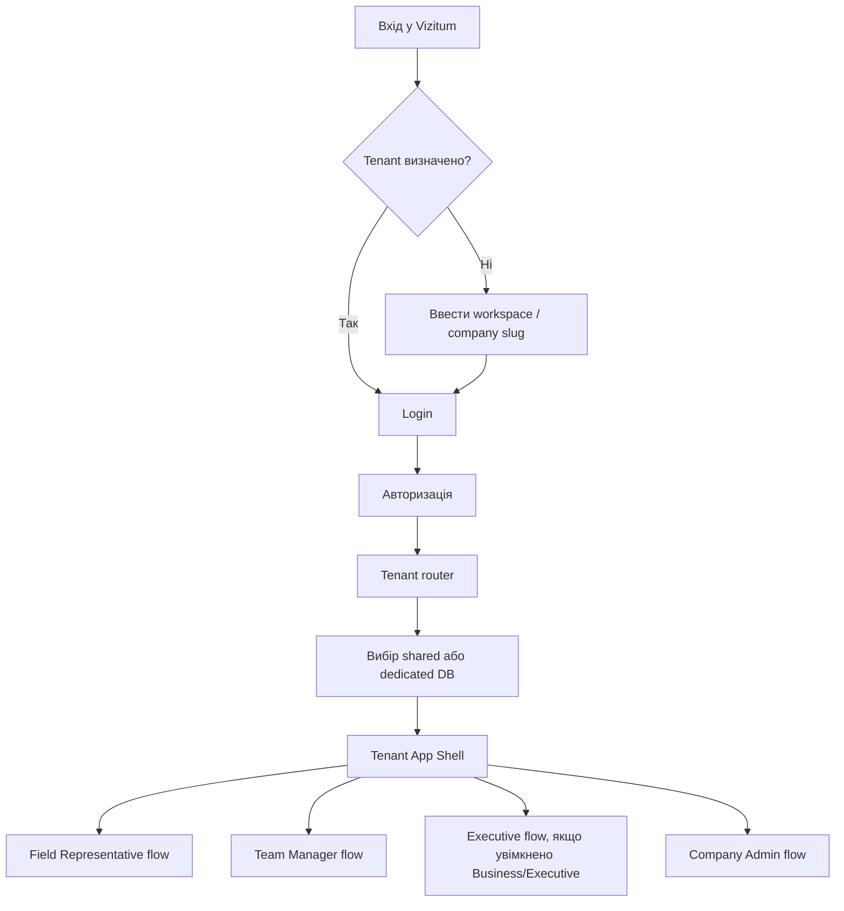
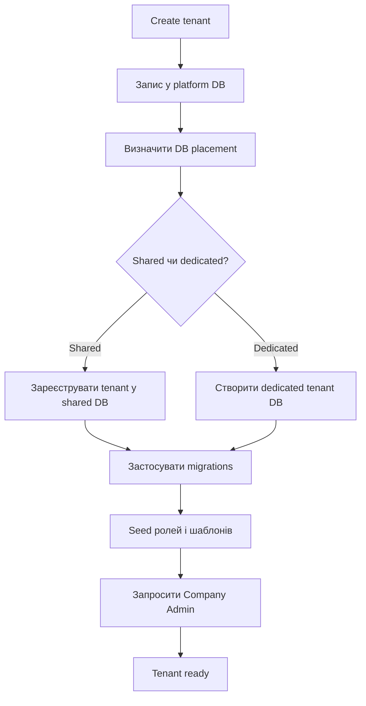
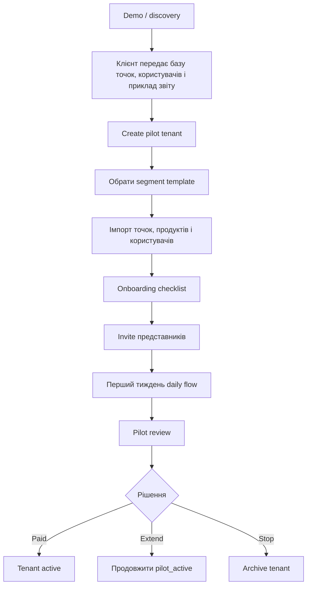
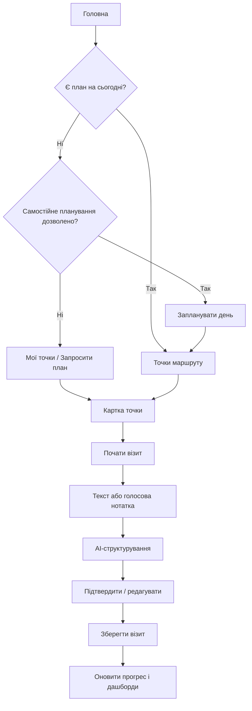
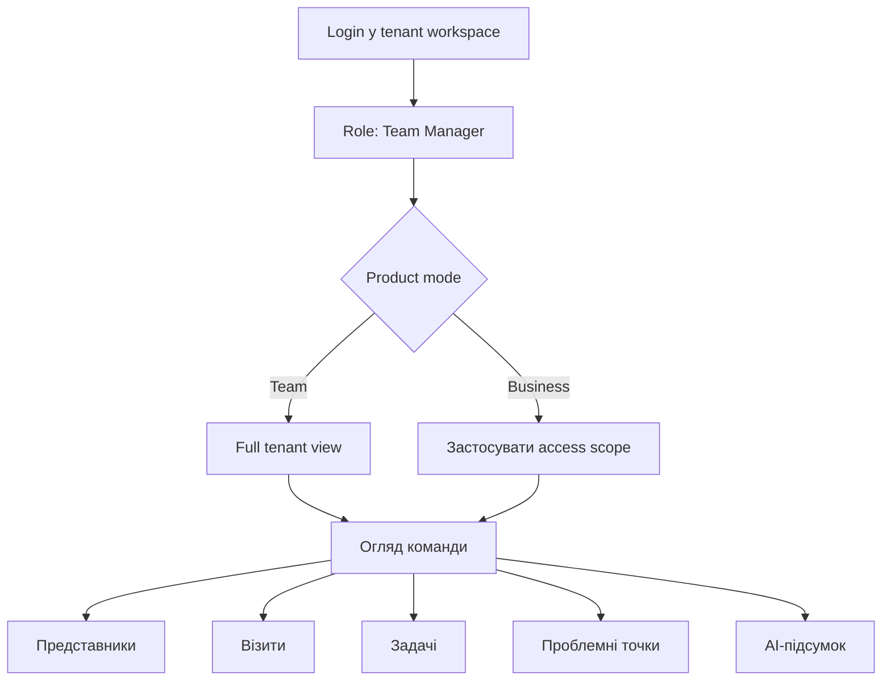
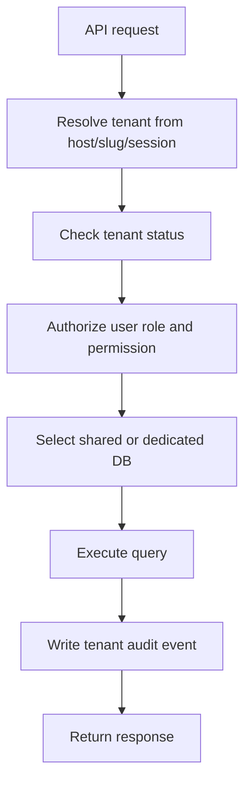
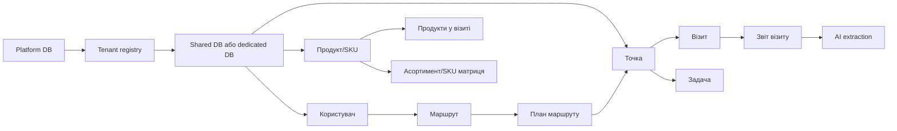

# Vizitum: user flow для гібридної tenancy-платформи

## 1. Призначення платформи

Vizitum - це веб-платформа для польових команд, які планують маршрути, проводять візити до точок, фіксують результати, працюють з продуктами, задачами та управлінською аналітикою.

Архітектурна модель платформи: **гібридна tenancy-модель** з можливістю horizontal partition для більших клієнтів.

Це означає:

- web/app layer спільний для всіх клієнтів;
- для пілотів і малих компаній використовується shared tenant database з логічною ізоляцією по tenant;
- для Business клієнтів dedicated tenant database доступна як paid option;
- кожен запит виконується в контексті конкретного tenant;
- користувачі, точки, продукти, візити, задачі та звіти завжди належать конкретному tenant;
- центральна platform database зберігає tenant registry, billing/status, database placement, routing rules, глобальні налаштування та операційні метадані.

Головна ціль user flow: зробити так, щоб пілоти і малі компанії запускались швидко в shared DB, але більші клієнти могли перейти на dedicated DB без зміни web/app layer.

### Модель розміщення даних

| Сегмент | Базова модель | Опція | Логіка |
| --- | --- | --- | --- |
| Pilot | shared DB | ні або тільки вручну | швидкий запуск, мінімальна операційна вартість |
| Team/small business | shared DB | exception/manual approval only | оптимально для малих команд і повторюваних пілотів; dedicated DB не є стандартною Team-опцією |
| Business | shared DB або dedicated DB | так | клієнт може обрати ізоляцію даних як частину пакета |

Важливе правило: tenant isolation обовʼязкова в обох моделях. У shared DB вона забезпечується через `tenant_id`, RLS/policy layer, tenant-aware queries та тести ізоляції. У dedicated DB вона посилюється фізичним розділенням бази, але app layer залишається спільним.

### Тарифні пакети і продуктовий scope

DB placement не є єдиною різницею між пакетами. Для sales, onboarding і permissions важливо, щоб тариф також визначав типовий розмір команди, доступні ролі і набір управлінських можливостей.

Ролі в tenant мають бути additive, а не взаємовиключні: один користувач може мати кілька ролей, а effective permissions формуються як об'єднання призначених ролей з урахуванням product mode і access scope.

| Пакет | Для кого | Типові ролі | Ключові фічі першого scope |
| --- | --- | --- | --- |
| Pilot | 5-10 представників на 14-30 днів, з першим review після 7-10 днів | Platform Owner для tenant setup, Company Admin, Field Representative, Team Manager для review; ролі можуть поєднуватись | assisted launch від Vizitum, production-ready segment template, імпорт стартових даних під відповідальністю Company Admin, базові візити, AI-структурування нотаток, задачі, manager dashboard, pilot review metrics |
| Team | 5-30 представників | Company Admin, Field Representative, один або кілька Team Manager з full tenant view; Company Admin може також бути Team Manager | усе з Pilot, повна база точок/клієнтів/партнерів/обʼєктів, необмежені візити, задачі й контроль виконання, простий дашборд керівника по всій команді, призначення маршрутів Team Manager, самостійне створення або зміна власного маршруту Field Representative на базі призначених йому локацій, експорт даних, щомісячний review на перші 2 місяці |
| Business | 30+ представників або кілька регіонів | Company Admin, Field Representative, кілька Team Manager з access scope, Company Owner / Executive; Team Manager може також бути Field Representative | усе з Team, access scope для регіонів/команд/територій/груп точок, регіональна структура, Executive Dashboard, розширені звіти, розширені AI-підсумки по команді/регіонах/продуктах, custom fields, dedicated DB як опція |

### Продуктові режими: Team default і Business extension

Маркетингова і реалізаційна модель мають збігатися: **Team і Business не є окремими платформами або codebase**. Це два продуктові режими одного tenant app layer і однієї доменної моделі.

`Team` - базовий режим для перших продажів і MVP. У ньому tenant має просту управлінську модель:

- один або кілька Team Manager, які бачать всю команду;
- Company Admin відповідає за користувачів, ролі, імпорти, довідники і tenant settings;
- усі представники, точки, маршрути, візити і задачі належать одному tenant workspace;
- регіон, територія або група точок можуть існувати як поля і фільтри, але не як складна permission-модель;
- manager dashboard показує всю команду за замовчуванням;
- Executive Dashboard, granular access scope і dedicated DB не є обов'язковими для запуску.

`Business` - розширення для 30+ представників, кількох регіонів або кількох керівників. У цьому режимі вмикаються:

- кілька Team Manager з різними зонами відповідальності;
- access scope для регіонів, команд, територій, груп точок або окремих представників;
- Company Owner / Executive role і Executive Dashboard;
- розширені AI-підсумки по регіонах, командах, продуктах або бізнес-напрямках;
- dedicated database як paid option для Business, без окремого четвертого пакета.

Правило переходу: клієнт може стартувати в `Team`, а потім перейти в `Business` без міграції на інший продукт. Перехід вмикає додаткові capabilities і складніші permissions, але не змінює core-сутності: users, locations, products, routes, visits, tasks, reports і tenant isolation.

## 2. Рівні користувачів

### Multi-role users

Один user account може мати кілька ролей в одному tenant. Це потрібно для малих команд і перших пілотів, де одна людина часто виконує кілька функцій.

Підтримувані комбінації першого scope:

- `Company Admin + Team Manager` - людина налаштовує tenant і одночасно керує польовою командою.
- `Team Manager + Field Representative` - керівник має dashboard команди, але також може мати власний маршрут з призначених йому локацій і виконувати візити.
- `Company Admin + Team Manager + Field Representative` - допустимо для дуже малого пілоту, але не має бути рекомендованою моделлю для масштабування.

При кількох ролях навігація має показувати role switcher або режим роботи. За замовчуванням можна відкривати останній використаний режим; якщо його немає, система може застосувати пріоритет `Company Admin`, `Team Manager`, `Executive`, `Field Representative` для desktop і `Field Representative`, `Team Manager`, `Company Admin`, `Executive` для mobile.

### Platform Owner

Внутрішня роль команди Vizitum. Керує tenant setup, provisioning, станом tenant database або shared tenant pool, тарифами, capabilities та операційним моніторингом. Platform Owner створює технічний контейнер для клієнта і додає одного або кількох Company Admin, але не є щоденним адміністратором клієнтських користувачів, ролей, маршрутів або довідників.

Доступні розділи:

- `Tenants` - список клієнтських середовищ.
- `Provisioning` - створення і налаштування tenant placement.
- `Imports` - статуси import jobs і технічні помилки імпорту.
- `Templates` - базові шаблони процесів, ролей, полів, AI-структурування.
- `Operations` - health, errors, usage, background jobs.
- `Billing` - тариф, статус оплати, ліміти.

### Company Admin

Адміністратор конкретної компанії-клієнта. Працює тільки всередині свого tenant workspace і відповідає за операційне налаштування компанії після створення tenant.

Доступні розділи:

- `Огляд` - admin overview, onboarding checklist і статус готовності tenant.
- `Точки` - аптеки, клініки, магазини, партнери або інші точки.
- `Користувачі` - представники, керівники, адміністратори.
- `Продукти` - продукти, SKU, товарні групи.
- `Імпорти` - завантаження та перевірка стартових даних.
- `Шаблони` - шаблон візиту, поля, довідники, segment preset.
- `Налаштування` - профіль компанії, branding, правила доступу і базові tenant settings.

### Team Manager

Керівник польової команди, регіону або напрямку. Це окрема бізнес-роль, не те саме, що `Company Admin`. Керівник заходить у той самий tenant workspace, але після логіну потрапляє в управлінський dashboard, а не в налаштування системи.

У режимі `Team` керівник за замовчуванням бачить всю команду tenant. Це найпростіший і найважливіший flow для перших продажів: один керівник відкриває `Огляд команди` і бачить активність, задачі, маршрути, проблемні точки та аналітику без налаштування складних доступів.

У режимі `Business` керівник бачить команду, активність, задачі, маршрути, проблемні точки та аналітику в межах свого access scope. Scope може бути:

- вся компанія;
- один або кілька регіонів;
- одна або кілька команд;
- конкретні представники;
- конкретні території або групи точок.

Керівник за замовчуванням не має доступу до імпортів, billing, tenant settings, налаштування полів, призначення ролей або керування платформою. Його операційна зона - маршрути, план/факт, команда, візити, задачі та аналітика.

Доступні розділи:

- `Огляд команди`.
- `Карта / покриття`.
- `Візити`.
- `Задачі`.
- `Точки`.
- `Представники`.
- `Звіти`.

### Company Owner / Executive

Власник, CEO, комерційний директор або топкерівник компанії. Це роль для high-level перегляду бізнес-показників без щоденного операційного адміністрування системи.

Executive - не обов'язкова роль для `Team`. Для малих команд high-level огляд може виконувати Team Manager через manager dashboard. Окрема Executive role вмикається переважно для `Business`, коли є кілька регіонів, команд або управлінських рівнів.

Executive бачить аналітику по всій компанії або по дозволених бізнес-напрямках:

- загальну активність польової команди;
- план/факт по компанії, регіонах і командах;
- покриття точок;
- динаміку візитів;
- проблемні точки і продукти;
- відкриті та прострочені задачі;
- AI-підсумки по компанії, регіонах або продуктах;
- експорт управлінських звітів.

Executive не налаштовує довідники, імпорти, поля, provisioning або database placement без додаткових прав.

Доступні розділи:

- `Executive Dashboard`.
- `Команди`.
- `Регіони`.
- `Покриття`.
- `Звіти`.
- `AI-підсумки`.

### Field Representative

Польовий користувач. Основний mobile-first flow: план на день, маршрут, картка точки, візит, звіт, задачі.

Доступні розділи:

- `Головна` - план на сьогодні.
- `Маршрути` - власні маршрути і планування.
- `Точки` - закріплені точки.
- `Зведення` - історія візитів.
- `Налаштування`.

## 3. Загальна модель навігації

Платформа має два рівні навігації:

- platform navigation для команди Vizitum;
- tenant navigation для користувачів конкретної компанії.

Клієнт може заходити через:

- спільний домен з tenant slug: `app.vizitum.com/{tenant}`;
- або branded subdomain: `{tenant}.vizitum.com`;

## 4. Tenant provisioning flow

### Ціль

Команда Vizitum створює нове клієнтське середовище для пілоту або платного клієнта без ручного копіювання коду і без окремого web deployment. За замовчуванням tenant розміщується у shared DB; dedicated DB обирається як paid option для Business або як exception/manual approval only для спеціальних вимог.

### Кроки

1. Platform Owner відкриває `Tenants`.
2. Натискає `Create tenant`.
3. Заповнює:
   - назву компанії;
   - tenant slug;
   - segment template: `distribution`, `service` або `partner_account`;
   - тариф: pilot, team або business;
   - product mode: `team` або `business`;
   - країну, timezone, мову;
   - контактну особу;
   - database placement: shared або dedicated.
4. Опційно додає onboarding metadata, якщо ці дані вже відомі після discovery:
   - estimated users count;
   - estimated locations count;
   - onboarding notes.
5. Система створює запис у platform database.
6. Provisioning job визначає database placement. Для `pilot` і `team` за замовчуванням використовується shared tenant database. Для `business` можна створити dedicated tenant database як paid option.
7. Система визначає product capabilities. Для `team` вмикаються базові ролі, full-team manager dashboard і прості фільтри. Для `business` додатково вмикаються access scope, регіональна структура, Executive Dashboard і розширені звіти.
8. Система перевіряє або застосовує базові migrations до відповідної database.
9. Система встановлює стартові довідники і шаблони:
   - ролі;
   - типи точок;
   - типи візитів;
   - статуси задач;
   - шаблон AI-структурування;
   - стандартні поля.
10. Система створює першого Company Admin.
11. Company Admin отримує invite email.
12. Tenant переходить у статус `ready`.

`estimated users count` і `estimated locations count` не є обов'язковими для tenant creation і не є source of truth для billing, limits, permissions або product mode.

### Статуси tenant

- `draft` - створено запис, але provisioning ще не почався.
- `provisioning` - визначається database placement, tenant реєструється у shared DB або створюється dedicated DB, застосовуються migrations.
- `ready` - клієнтське середовище готове.
- `pilot_active` - триває пілот.
- `active` - платний клієнт.
- `suspended` - доступ обмежено.
- `archived` - клієнт відключений, дані збережені згідно політики.

## 5. Onboarding клієнта

### Ціль

Company Admin готує робоче середовище для своєї команди: користувачі, точки, продукти, ролі, поля, довідники і базові правила доступу. Маршрути та щоденне планування можуть створюватися Team Manager для команди і Field Representative для власного робочого дня на базі призначених йому локацій.

Для `Team` onboarding має залишатися коротким: імпорт точок, імпорт користувачів, продукти/SKU, базовий шаблон візиту, перший маршрут і дашборд керівника. Регіони або території можуть бути простими полями для фільтрації, але не блокують запуск.

Для `Business` onboarding додає налаштування регіональної структури, кількох керівників, access scope, Executive Dashboard і, за потреби, dedicated database.

Для перших продажів і pilot launch це не обов'язково self-serve процес. Команда Vizitum може створити tenant, обрати segment template, допомогти з імпортом і супроводити pilot review. Але операційний власник налаштувань всередині tenant - Company Admin: він підтверджує користувачів, ролі, довідники, території, правила доступу і шаблон візиту. Team Manager планує маршрути для команди, а Field Representative може паралельно створювати або змінювати власний маршрут чи план дня тільки на базі призначених йому локацій.

### Кроки

1. Company Admin переходить за invite link.
2. Встановлює пароль або входить через доступний auth provider.
3. Потрапляє в onboarding checklist.
4. Company Admin завантажує базу точок через CSV/XLSX або приймає assisted import від команди Vizitum.
5. Company Admin завантажує список продуктів або SKU або підтверджує assisted import.
6. Company Admin додає користувачів вручну або імпортом.
7. Company Admin призначає ролі. Для `Team` достатньо Company Admin, керівника і представників; для `Business` додатково перевіряються access scope і керівники регіонів/команд.
8. Company Admin перевіряє типи точок, поля і шаблон візиту.
9. Team Manager перевіряє тестовий маршрут, а Field Representative може створити або адаптувати власний план дня після invite на базі призначених йому локацій.
10. Company Admin запрошує представників.
11. Tenant переходить у статус `pilot_active`.

### Onboarding checklist

- компанія створена;
- перший адміністратор активний;
- точки імпортовані або підтверджені Company Admin;
- продукти імпортовані або підтверджені Company Admin;
- користувачі створені Company Admin;
- ролі призначені Company Admin;
- для `Team`: керівник має full tenant view і може бачити всю команду;
- для `Business`: території, регіони і access scope налаштовані та підтверджені з Company Admin;
- шаблон візиту обраний і підтверджений з Company Admin;
- AI-структурування протестоване;
- перший маршрут створений або призначений Team Manager чи створений Field Representative для власного дня з призначених йому локацій.

## 6. Pilot launch flow

### Ціль

Зв'язати sales/demo обіцянку з реальним запуском tenant: після демо клієнт має швидко перейти від Excel або месенджерів до першого робочого тижня у Vizitum без кастомної розробки.

Пілот не є окремим продуктом або окремим deployment. Це звичайний tenant зі статусом `pilot_active`, який за замовчуванням працює у shared tenant database, використовує segment template і має обмежений scope користувачів, точок та періоду тестування.

### Передумови від клієнта

Для запуску пілоту клієнт надає:

- базу торгових точок, клієнтів, партнерів або об'єктів у CSV/XLSX;
- список представників, керівника і відповідального адміністратора;
- продукти, SKU або товарні групи, якщо вони мають фіксуватись у візитах;
- регіони, території або просте правило розподілу точок;
- приклад поточного звіту після візиту;
- критерії успішного пілоту.

### Кроки

1. Sales або Platform Owner створює pilot record у platform database.
2. Platform Owner створює tenant з тарифом `pilot`, segment template і database placement `shared`.
3. Provisioning job створює tenant context, застосовує migrations і seed templates.
4. Platform Owner додає одного або кількох Company Admin.
5. Company Admin і команда Vizitum проходять onboarding checklist як спільний launch checklist.
6. Company Admin імпортує або підтверджує assisted import точок, користувачів і продуктів.
7. Система застосовує segment template для типів точок, візитів, полів, dashboard preset-ів і AI extraction schema.
8. Company Admin перевіряє ролі, Team Manager перевіряє тестовий маршрут, Field Representative може створити або змінити власний план дня на базі призначених йому локацій, команда Vizitum допомагає з AI-структуруванням. Для `Team` керівник отримує full tenant view; для `Business` додатково перевіряються access scope.
9. Представники отримують invite і починають daily flow.
10. Керівник бачить перші візити, задачі, покриття і AI-підсумки у dashboard.
11. Після 7-10 днів система або команда Vizitum готує pilot review.
12. Після фінального review tenant переходить у `active`, лишається `pilot_active` для продовження тесту або архівується.

### Pilot review

Pilot review має спиратися на ті самі сутності, які є в продукті:

- активні представники;
- кількість створених візитів;
- кількість AI-оброблених текстових або голосових звітів;
- кількість створених і закритих задач;
- покриті точки;
- точки з високим потенціалом без покриття;
- перегляди dashboard керівником;
- середній час або суб'єктивне зменшення ручної звітності;
- повторювані заперечення, проблемні SKU або наступні дії з AI summaries.

## 7. Tenant-aware авторизація

### Вхід користувача

1. Користувач відкриває tenant URL.
2. App layer визначає tenant за subdomain або slug.
3. Система перевіряє tenant registry у platform database.
4. Якщо tenant активний, користувач бачить login screen з branding компанії.
5. Після логіну auth layer отримує:
   - user id;
   - tenant id;
   - role;
   - permissions;
   - database placement і routing key.
6. Усі подальші API-запити виконуються тільки в контексті tenant. App layer обирає shared або dedicated database за tenant registry.
7. Після входу система відкриває стартовий екран відповідно до ролі або останнього обраного role mode:
   - `Field Representative` -> `Головна`;
   - `Team Manager` -> `Огляд команди`;
   - `Company Admin` -> `Admin / Огляд`;
   - `Executive` -> `Executive Dashboard`, якщо така роль увімкнена;
   - `Platform Owner` -> `Platform Console`.
8. Якщо користувач має кілька ролей у tenant, shell показує перемикач режимів, наприклад `Admin`, `Team`, `Field`, `Executive`.

### Якщо tenant не знайдено

Користувач бачить сторінку:

- workspace not found;
- звернутися до адміністратора;
- перейти до вибору іншого workspace.

### Якщо tenant suspended

Користувач бачить сторінку:

- доступ тимчасово обмежений;
- контакт адміністратора компанії;
- контакт підтримки Vizitum.

## 8. Основний денний flow представника

### Ціль

Представник бачить свій план на сьогодні, проходить точки, фіксує візити, створює задачі і оновлює інформацію по точках.

### Кроки

1. Представник входить у tenant workspace.
2. Система відкриває `Головна`.
3. Додаток показує:
   - дату;
   - прогрес дня;
   - заплановані маршрути;
   - точки маршруту;
   - відкриті задачі;
   - швидку дію `Почати візит`.
4. Якщо маршруту немає, представник бачить empty state з діями:
   - `Запланувати день`;
   - `Переглянути мої точки`;
   - `Запросити план у керівника`.
5. Представник відкриває точку.
6. У картці точки переглядає:
   - адресу і контакти;
   - сегмент;
   - потенціал;
   - продукти/SKU;
   - задачі;
   - історію візитів;
   - попередні AI-підсумки.
7. Натискає `Почати візит`.
8. Заповнює або диктує результат.
9. AI структурує нотатку.
10. Представник підтверджує або редагує AI-пропозиції.
11. Зберігає звіт.
12. Дані потрапляють у database, привʼязану до tenant і стають доступні керівнику.

## 9. Flow картки точки

Картка точки є універсальною. У першому MVP вона покриває торгового партнера для `distribution`, об'єкт обслуговування для `service` і партнера або key account для `partner_account`. У перспективних vertical presets це може бути аптека, клініка, магазин, мережа або інша спеціалізована точка.

### Базові блоки

- назва;
- тип точки;
- адреса;
- контакти;
- відповідальний представник;
- територія;
- статус;
- сегмент;
- потенціал;
- останній візит;
- наступна дія.

### Конфігуровані блоки

Company Admin може вмикати або вимикати:

- асортимент;
- потенціал по групах;
- SKU-матрицю;
- фото;
- чеклист візиту;
- промо-матеріали;
- залишки;
- замовлення;
- мерчандайзинг;
- custom fields.

### Дії

Користувач може:

- почати візит;
- створити задачу;
- оновити контактні дані;
- переглянути історію;
- додати нотатку;
- оновити асортимент або SKU;
- переглянути AI-підсумки по точці.

## 10. Flow створення візиту

### Вхідні точки

Створити візит можна:

- з картки точки;
- з денного маршруту;
- з календаря;
- через quick action;
- з задачі.

### Поля форми

Базові поля:

- точка;
- дата і час;
- тип візиту;
- результат;
- нотатки;
- наступна дія;
- задачі;
- презентовані продукти;
- статуси SKU або асортименту.

Додаткові поля залежать від tenant configuration.

### Голосовий і AI flow

1. Представник натискає кнопку мікрофона.
2. Диктує результат візиту.
3. Система зберігає raw audio у tenant-scoped storage.
4. Transcription service створює raw transcript.
5. AI extraction service застосовує tenant-specific шаблон.
6. Система показує structured draft:
   - короткий підсумок;
   - домовленості;
   - заперечення;
   - проблемні продукти;
   - наступні дії;
   - задачі;
   - оновлення по SKU.
7. Представник підтверджує або редагує.
8. API зберігає raw note, transcript, AI output і фінальний звіт у database, привʼязану до tenant.

### Важливе правило

AI output не має автоматично змінювати бізнес-дані без підтвердження користувача, окрім явно дозволених low-risk полів.

## 11. Flow маршрутів і планування

### Представник

Представник може:

- переглядати власні маршрути;
- створювати або змінювати власний маршрут чи план дня тільки на базі призначених йому локацій;
- додавати позапланову призначену точку або візит з маркуванням `unplanned`;
- бачити план/факт.

### Керівник

Керівник може:

- створювати маршрути для команди;
- призначати маршрути представникам;
- переглядати покриття території;
- бачити пропущені точки;
- порівнювати план/факт;
- аналізувати частоту візитів.

### Company Admin

Company Admin налаштовує:

- території;
- у `Team`: прості правила закріплення точок за представниками і фільтри;
- у `Business`: правила видимості точок для регіонів, команд і керівників;
- правила самостійного планування з призначених локацій і конфліктів між планом Team Manager та власним планом Field Representative;
- базові шаблони робочого тижня як tenant setting, якщо це потрібно для старту.

Company Admin не призначає маршрути представникам і не веде щоденне планування. Це зона Team Manager для командного планування і Field Representative для власного маршруту чи плану дня.

## 12. Flow керівника команди

### Ціль

Керівник заходить у Vizitum, щоб щодня бачити реальну роботу польової команди, контролювати план/факт, знаходити проблемні точки, переглядати візити і ставити задачі представникам.

Керівник не є системним адміністратором за замовчуванням. Його основний сценарій - управління командою та аналітика, а не налаштування tenant.

### Створення керівника

1. Company Admin відкриває `Користувачі`.
2. Створює або редагує користувача.
3. Призначає роль `Team Manager`. Це може бути інший користувач або сам Company Admin.
4. Для tenant у режимі `Team` система за замовчуванням дає керівнику full tenant view: усі представники, точки, маршрути, візити, задачі і dashboard.
5. Для tenant у режимі `Business` Company Admin визначає access scope:
   - вся компанія;
   - регіон;
   - команда;
   - список представників;
   - територія або група точок.
6. Система надсилає invite email.
7. Керівник активує акаунт і входить у tenant workspace.

Якщо керівник також працює в полі, Company Admin може додати цьому ж користувачу роль `Field Representative`. У такому випадку користувач має два робочі режими:

- `Team Manager` - dashboard, маршрути, задачі і аналітика команди.
- `Field Representative` - власний план на день з призначених локацій, картки точок, візити, нотатки і задачі.

### Вхід керівника

1. Керівник відкриває tenant URL, наприклад `{tenant}.vizitum.com`.
2. Вводить email і пароль.
3. Auth layer визначає tenant, product mode, роль і permissions.
4. Після логіну система відкриває `Огляд команди`.
5. У режимі `Team` dashboard показує всю команду tenant.
6. У режимі `Business` dashboard фільтрується за access scope керівника.

### Огляд команди

Керівник бачить:

- активність сьогодні;
- хто вже почав день;
- хто не має запланованого маршруту;
- план/факт візитів;
- візити за день, тиждень або період;
- відкриті задачі;
- прострочені задачі;
- точки без візитів;
- високий потенціал без покриття;
- проблемні продукти або SKU;
- активність по представниках;
- AI-підсумок по команді.

### Щоденний flow керівника

1. Керівник відкриває `Огляд команди`.
2. Перевіряє, хто з представників має план на сьогодні.
3. Дивиться план/факт візитів.
4. Відкриває список проблемних або пропущених точок.
5. Переглядає нові звіти візитів.
6. Перевіряє AI-підсумок дня.
7. Створює задачі представникам або залишає коментарі.
8. За потреби переходить у картку представника, точки або конкретного візиту.

### Drill-down

Керівник може перейти:

- у `Team`: з огляду всієї команди до представника, маршруту, точки, візиту або задачі;
- у `Business`: з компанії або регіону до команди;
- з команди до представника;
- з представника до маршруту;
- з маршруту до точки;
- з точки до історії візитів;
- з візиту до raw note, transcript і AI extraction;
- з AI-підсумку до конкретного raw report;
- з проблемного SKU до точок, де він згадувався.

### Дії керівника

Керівник може:

- створити задачу для представника;
- прокоментувати візит;
- позначити візит як переглянутий;
- призначити follow-up по точці;
- змінити пріоритет точки, якщо це дозволено правами;
- експортувати звіт за період;
- у `Team`: переглянути AI summary по дню, тижню або представнику;
- у `Business`: переглянути AI summary по дню, тижню, регіону, команді або представнику.

Керівник не може без додаткових прав:

- змінювати tenant settings;
- керувати billing;
- запускати provisioning;
- змінювати database placement;
- редагувати глобальні шаблони;
- імпортувати великі довідники, якщо це не дозволено Company Admin.

### Weekly review

1. Керівник відкриває період тижня.
2. Система показує ключові зміни по команді.
3. AI формує короткий management summary.
4. Керівник переглядає:
   - найактивніших представників;
   - точки без покриття;
   - прострочені задачі;
   - проблемні продукти;
   - повторювані заперечення з візитів.
5. Керівник створює задачі або follow-up для представників.
6. За потреби експортує короткий звіт для комерційного директора.

### Access scope rules

- У режимі `Team` керівник має full tenant view. Якщо в Team є кілька керівників, вони бачать однаковий tenant-wide набір даних; різна видимість по регіонах, командах, територіях або групах точок вмикається через `Business`.
- У режимі `Business` керівник бачить тільки ті дані, які входять у його scope.
- Якщо представник переходить в інший регіон, видимість для керівника оновлюється через territory/team assignment.
- API не приймає `manager_id` або `team_id` з client-side як джерело правди. Scope визначається на backend за роллю і tenant permissions.
- AI summaries для керівника формуються тільки з даних, доступних цьому керівнику.

## 13. Company Admin flow

### Управління користувачами

Company Admin може:

- створювати користувачів;
- імпортувати користувачів;
- запрошувати користувачів;
- активувати і деактивувати акаунти;
- призначати ролі;
- призначати собі роль `Team Manager`, якщо адміністратор також керує командою;
- додавати роль `Field Representative` користувачу з роллю `Team Manager`, якщо керівник також виконує візити;
- у `Team`: призначати одного або кількох керівників з full tenant view;
- у `Business`: призначати керівників і access scope;
- призначати території;
- скидати доступ;
- переглядати останню активність.

### Управління точками

Company Admin може:

- створювати точки;
- імпортувати точки;
- редагувати точки;
- об'єднувати дублікати;
- призначати відповідальних;
- сегментувати точки;
- у `Team`: використовувати регіони, території або групи точок як прості поля та фільтри;
- у `Business`: керувати мережами, регіонами, командами, територіями і категоріями як частиною access model.

### Управління продуктами

Company Admin може:

- створювати продукти/SKU;
- імпортувати продукти;
- групувати продукти;
- деактивувати продукти;
- налаштовувати видимість продуктів для команд.

### Налаштування процесу

Company Admin може налаштувати:

- типи візитів;
- обов'язкові поля;
- базові custom fields;
- шаблони задач;
- шаблони AI extraction;
- branding;
- мову;
- експортні формати.

Business-only налаштування:

- granular access scope;
- регіональна структура і кілька команд;
- Executive Dashboard;
- розширені custom fields;
- dedicated database option;
- інтеграції після окремої оцінки.

## 14. Platform operations flow

### Моніторинг tenant health

Platform Owner бачить:

- статус tenant database або shared DB pool;
- останню міграцію;
- кількість активних користувачів;
- кількість API помилок;
- чергу background jobs;
- помилки AI/transcription;
- storage usage;
- database size і tenant storage usage.

Platform Owner може бачити статус import jobs, але не є власником клієнтських імпортів. Якщо імпорт виконується командою Vizitum у форматі assisted launch, Company Admin все одно підтверджує бізнес-правильність даних і ролей.

### Міграції

1. Команда Vizitum готує нову schema migration.
2. Migration runner перевіряє shared DB pools і dedicated tenant databases.
3. Міграція застосовується поступово.
4. Для кожного tenant зберігається статус:
   - pending;
   - running;
   - success;
   - failed;
   - rolled back/manual action required.
5. App layer має знати мінімальну підтримувану schema version.

### Backup і restore

Restore flow має підтримувати два сценарії: tenant-level restore для shared DB і full database restore для dedicated DB:

1. Platform Owner відкриває tenant.
2. Обирає backup point.
3. Запускає restore у staging або recovery database.
4. Перевіряє цілісність.
5. Перемикає tenant routing або експортує потрібні дані.

## 15. Data isolation flow

Кожен API-запит має проходити tenant resolution.

Правила:

- API не приймає tenant id з body як джерело правди;
- tenant визначається з host/slug/session/token;
- platform database не зберігає бізнес-дані клієнта, окрім мінімальних операційних метаданих;
- dedicated tenant database не має знати про інші tenant; shared database обовʼязково фільтрується по tenant_id;
- background jobs завжди мають явний tenant context;
- logs не повинні містити чутливі raw notes або transcripts.

## 16. Основні доменні зв'язки

## 17. Ключові API-зони

### Platform API

| Дія | Endpoint |
| --- | --- |
| Список tenants | `/api/platform/tenants` |
| Створення tenant | `/api/platform/tenants` |
| Статус provisioning | `/api/platform/tenants/{tenantId}/provisioning` |
| Запуск імпорту | `/api/platform/tenants/{tenantId}/imports` |
| Health tenant | `/api/platform/tenants/{tenantId}/health` |
| Міграції | `/api/platform/migrations` |

### Tenant API

| Дія | Endpoint |
| --- | --- |
| Поточний workspace | `/api/me/workspace` |
| Денний план | `/api/route-plans/{date}` |
| Візити | `/api/visits`, `/api/visits/{id}` |
| AI-обробка звіту | `/api/visits/{id}/ai-extract` або `/api/visit-drafts/ai-extract` |
| Audio upload | `/api/visit-drafts/{id}/audio` |
| Транскрипція | `/api/visit-drafts/{id}/transcribe`, `/api/visit-drafts/{id}/transcription-status` |
| Точки | `/api/locations`, `/api/locations/{id}` |
| Продукти | `/api/products`, `/api/product-groups` |
| Задачі | `/api/tasks`, `/api/tasks/{id}` |
| Маршрути | `/api/routes`, `/api/route-plans` |
| Дашборд керівника | `/api/manager/dashboard` |
| Адмін-огляд | `/api/admin/dashboard` |
| Налаштування tenant | `/api/admin/settings` |

## 18. QA-сценарії

### Platform: створення нового пілоту

1. Увійти як Platform Owner.
2. Створити tenant з типом `pilot`, product mode `team` і database placement `shared`.
3. Переконатися, що створено tenant registry record.
4. Переконатися, що tenant отримав database placement `shared`.
5. Переконатися, що product capabilities для `team` увімкнені: базові ролі, full-team manager dashboard, прості фільтри.
6. Переконатися, що migrations виконані.
7. Переконатися, що seed data створена.
8. Додати одного або кількох Company Admin і надіслати invite.
9. Увійти через tenant subdomain.
10. Переконатися, що користувач бачить тільки дані свого tenant.

### Pilot launch: від демо до першого usage review

1. Створити pilot tenant з segment template `distribution`, `service` або `partner_account`.
2. Імпортувати або підтвердити тестову базу точок, список представників і продукти як Company Admin.
3. Переконатися, що застосовано відповідний segment template.
4. Переконатися, що onboarding checklist показує готовність tenant до invite представників.
5. Company Admin запрошує 2-3 представників і керівника.
6. Team Manager створює чи призначає перший маршрут або Field Representative створює власний план дня з призначених йому локацій.
7. Створити кілька візитів з AI-структуруванням.
8. Переконатися, що manager dashboard показує активність, задачі, покриття і AI-підсумки.
9. Сформувати pilot review за період 7-10 днів.
10. Перевести tenant у `active`, залишити `pilot_active` або архівувати.

### Company Admin + Vizitum: підготовка пілоту

1. Увійти як Company Admin.
2. Переконатися, що точки імпортовані або підтверджені Company Admin.
3. Переконатися, що продукти імпортовані або підтверджені Company Admin.
4. Переконатися, що представники створені Company Admin.
5. Перевірити ролі і території.
6. Перевірити шаблон візиту.
7. Team Manager перевіряє перший маршрут, а Field Representative може створити або змінити власний план дня після invite на базі призначених йому локацій.
8. Запросити представника через Company Admin.
9. Переконатися, що представник бачить лише свої точки.

### Представник: повний день

1. Увійти через tenant workspace.
2. Відкрити `Головна`.
3. Якщо плану немає або його треба адаптувати, створити або змінити власний маршрут чи план дня з призначених локацій.
4. Перейти до точки з маршруту.
5. Почати візит.
6. Продиктувати нотатку.
7. Перевірити transcript.
8. Підтвердити AI-структурування.
9. Зберегти звіт.
10. Переконатися, що прогрес дня оновився.
11. Переконатися, що керівник бачить візит у дашборді.

### Керівник: dashboard і scope

#### Multi-role: Company Admin + Team Manager

1. Увійти як Company Admin.
2. Відкрити власний user record у `Користувачі`.
3. Додати собі роль `Team Manager`.
4. Переконатися, що той самий user account має обидві ролі без дублювання email.
5. Переконатися, що shell показує перемикач режимів `Admin` і `Team`.
6. У режимі `Admin` користувач бачить onboarding checklist, users, imports і tenant settings.
7. У режимі `Team` користувач бачить `Огляд команди`, маршрути, задачі і manager dashboard.

#### Multi-role: Team Manager + Field Representative

1. Увійти як Company Admin.
2. Створити або відкрити користувача з роллю `Team Manager`.
3. Додати цьому ж користувачу роль `Field Representative`.
4. Призначити йому власні точки або маршрут як представнику.
5. Увійти цим користувачем.
6. Переконатися, що shell показує перемикач режимів `Team` і `Field`.
7. У режимі `Team` користувач бачить dashboard команди і може призначати маршрути.
8. У режимі `Field` користувач бачить власний план на день, може створити або змінити власний маршрут з призначених йому локацій, відкрити картку точки і створити власний візит.

#### Team mode: простий dashboard

1. Увійти як Company Admin.
2. Створити 2-3 представників.
3. Створити користувача з роллю `Team Manager`.
4. Не налаштовувати granular access scope.
5. Увійти як керівник.
6. Переконатися, що після логіну відкривається `Огляд команди`.
7. Переконатися, що dashboard показує всіх представників, точки, візити і задачі tenant.
8. Створити задачу для будь-якого представника.
9. Переконатися, що AI summary формується по всій команді.

#### Business mode: dashboard і scope

1. Увійти як Company Admin.
2. Створити двох представників у різних регіонах або командах.
3. Створити користувача з роллю `Team Manager`.
4. Призначити керівнику scope тільки на один регіон або одну команду.
5. Увійти як керівник.
6. Переконатися, що після логіну відкривається `Огляд команди`.
7. Переконатися, що dashboard показує тільки представників, точки, візити і задачі в межах scope.
8. Створити задачу для доступного представника.
9. Спробувати відкрити дані представника поза scope.
10. Переконатися, що доступ заборонено.
11. Переконатися, що AI summary не містить даних поза scope керівника.

### Data isolation

1. Створити два tenants.
2. У кожному tenant створити користувача, точки і продукти.
3. Увійти в tenant A.
4. Спробувати відкрити URL або API resource tenant B.
5. Переконатися, що доступ заборонено.
6. Перевірити, що background jobs tenant A не читають дані tenant B.

### Migration safety

1. Запустити migration на staging tenant.
2. Перевірити schema version.
3. Запустити batch migration на кількох tenants.
4. Симулювати помилку на одному tenant.
5. Переконатися, що інші tenants не заблоковані.
6. Переконатися, що failed tenant має статус manual action required.

## 19. Відомі обмеження і рішення на старті

- Для пілотів і малих компаній базова модель - shared tenant database з логічною ізоляцією по tenant_id.
- Dedicated database не варто робити правилом для базового пакета; це paid option для Business.
- Окремий app deployment на tenant не входить у продуктову лінійку `Pilot`, `Team`, `Business`.
- Перший MVP має бути `Team-first`: один керівник, full tenant view, простий manager dashboard, без обов'язкової регіональної permission-моделі.
- Business capabilities мають бути спроєктовані як розширення того самого ядра, але не повинні блокувати запуск Team.
- Tenant-specific custom logic має реалізовуватись через конфігурації, а не через fork коду.
- На старті продажів треба мати production-ready templates для перших GTM-сценаріїв: `distribution` для distribution/trade reps, `service` для service/field operations і `partner_account` для partner/account visits. Інші vertical presets можуть існувати тільки в template backlog або discovery notes і не мають розширювати MVP без підтвердженого попиту.
- Міграції shared DB і dedicated DB треба автоматизувати з першого етапу.
- AI prompts і extraction schemas мають бути версійовані.
- Імпорти повинні мати preview, validation і rollback/import history.
- Observability має показувати помилки в розрізі tenant, але без витоку бізнес-даних.

## 20. MVP-пріоритет для запуску

### Обов'язково для першої версії

- tenant registry;
- tenant resolution за subdomain або slug;
- shared database для pilot/team;
- provisioning script/job;
- product mode/capabilities: `team` як default, `business` як розширення;
- базові migrations;
- Company Admin invite;
- onboarding checklist;
- імпорт точок;
- імпорт користувачів;
- імпорт продуктів;
- segment templates `distribution`, `service` і `partner_account`;
- ролі;
- денний план;
- картка точки;
- створення візиту;
- голосова нотатка через mobile web/PWA recording або audio upload;
- tenant-scoped audio storage;
- transcription job зі статусами обробки;
- AI-структурування нотатки;
- задачі;
- manager dashboard у Team mode з full tenant view;
- pilot review metrics;
- tenant-level backup/restore для shared DB.

### Можна відкласти

- granular access scope для керівників;
- Executive Dashboard;
- dedicated database як paid option для Business;
- складний billing;
- marketplace інтеграцій;
- offline-first mobile;
- повний workflow builder;
- складний BI-конструктор.
